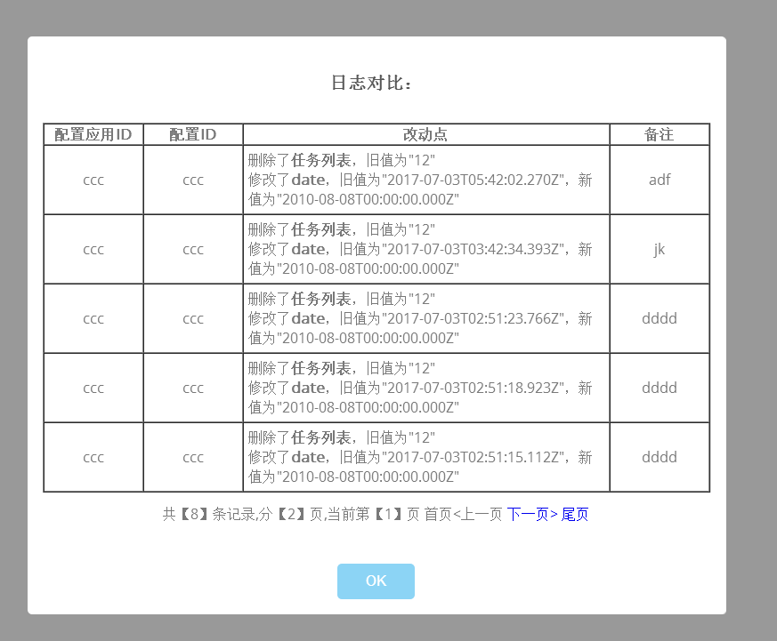
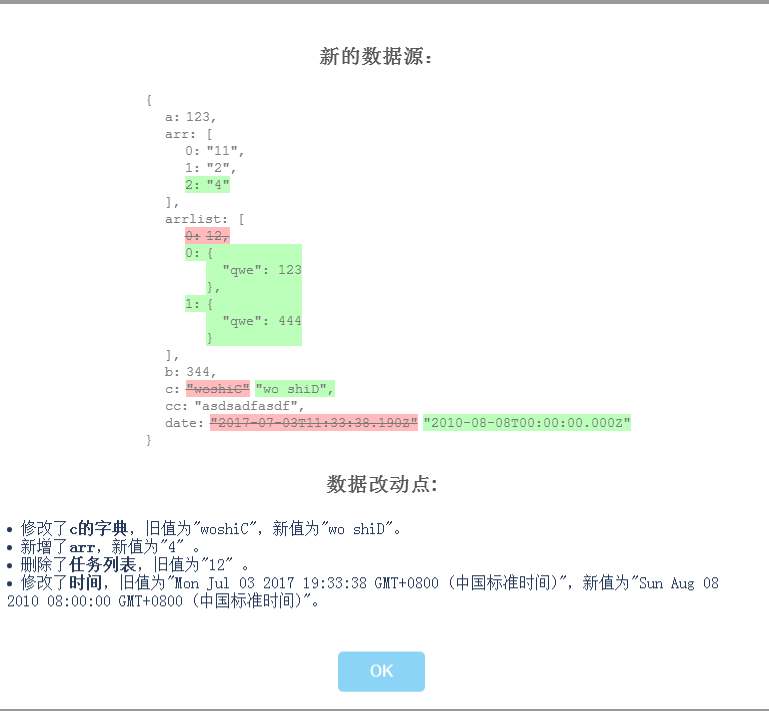
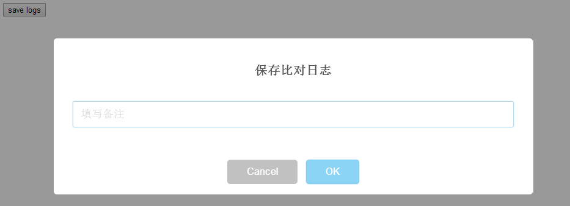

## 简介
- 任务：配置日志组件（config logs）
- 需求：表单修改前后【对比】及【日志】（保存）
- 包含（依赖）: 弹窗swal、对比jsondiff、手写分页table
- 有服务端接口提供
- Author: （陈雨浓）100013
- 数组对象支持性 比对流程还有待完善
## 效果
- 查看历史日志

- 查看差异

- 保存日志

## 演示代码
```js
var configLogs = new configLogs();

/**
* 显示当前表单的修改比对  在保存按钮旁边加一个修改比对按钮，点击触发`showDiff`；
* @param  {Object} oldData 旧的
* @param  {Object} newData 新的
* @param  {Object} mappingObj [数据字典]  若遗漏 显示key名
* @param  {Boolean} 是否显示弹窗 // 有可能只需要比对的弹窗
* @return {Object} object delta [返回比对差异 可用于保存savelog使用]
*/
var del = configLogs.showDiff({
    a: 123,
    e: 344,
    arrlist: [12],
    cc: 'asdsadfasdf',
    date: new Date()
}, {
    a: 123,
    f: 556,
    b: 'ddddddd',
    date: new Date('2010-08-08'),
    arrlist: [ 0, 4, 5],
    cc: 'asdsadfasdf'
}, {
    'a': 'a的字典',
    'b': 'b的字典',
    'c': 'b的字典',
    'd': 'b的字典',
    'e': 'b的字典',
    arrlist: '任务列表',
    date: '时间'
},true);

/**
* 显示日志  分页 在修改比对按钮旁边加一个查看修改日志按钮，点击触发
* @param  {String} domain 服务端域名     
* @param  {String} configAppID     配置应用的ID
* @param  {String} configID        配置ID
* @param  {Object}  mappingObj [数据字典] Object 若遗漏 显示key名
* @return  null
*/
configLogs.showLogs(
  'http://pbl4configlog.dev.web.nd',
  'ccc',
  'ccc',
  {
      arrlist: '任务列表'
  }
)

  /**
* 保存日志
*  @param  {String} domain 服务端域名     
* @param {String} configAppID 配置应用 ID
* @param {String} configID 配置 ID
* @param {[Object,..]} diff 比对内容
* @return  null
*/
configLogs.saveLog(  'http://pbl4configlog.dev.web.nd', 'ccc', 'ccc', del, 100013)

```


####  diff 场景
1.修改字段
> 修改了：任务名称，旧值为：日清，新值为：签到。
```
{
  "type": "update",  
  "key": "task_name",
  "old": "签到",          
  "new": "日清"    
}
```

2. 新增字段
> 新增了：任务名称，值为：签到。
```
{
  "type": "add",  
  "key": "task_name",
  "old": "",          
  "new": "日清"    
}
```

3. 删除字段
> 删除了字段：任务名称，旧值为：签到。
```
{
  "type": "delete"  
  "key": "task_name",
  "old": "签到",          
  "new": ""    
}
```
